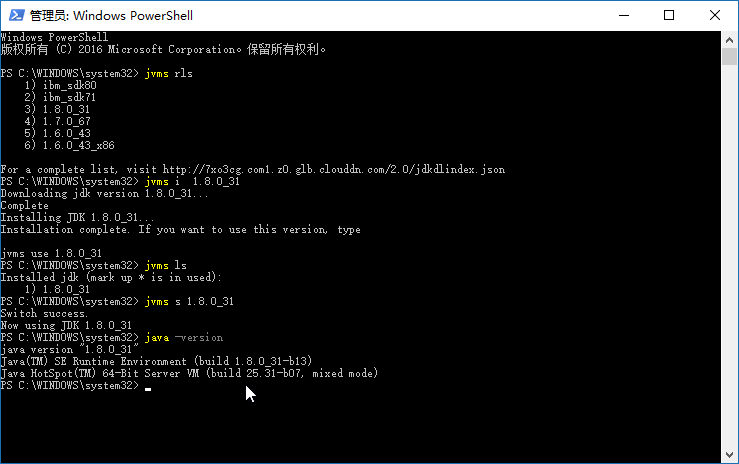

# JDK Version Manager (JVMS) for Windows

Manage multiple installations of JDK on a Windows computer.
[JVMS](https://github.com/ystyle/jvms), [Download Now](https://github.com/ystyle/jvms/releases)!


There are situations where the ability to switch between different versions of JDK can be very
useful. For example, if you want to test a project you're developing with the latest
bleeding edge version without uninstalling the stable version of JDK, this utility can help.

### Installation
- [Download Now](https://github.com/ystyle/jvms/releases)
- decompression zip and copy jvms.exe to a path what you want
- run cmd or powershell as administrator
- cd to folder where `jvms.exe` in
- run `jvms.exe init`
- Setup is complete ! Switch and install jdk see [Usage](#Usage) Section


### Usage
```shell
NAME:
   jvms - JDK Version Manager (JVMS) for Windows

USAGE:
   jvms.exe [global options] command [command options] [arguments...]

VERSION:
   2.0.0

COMMANDS:
     init        Initialize config file
     list, ls    List the JDK installations.
     install, i  Install remote available jdk
     switch, s   Switch to use the specified version.
     remove, rm  Remove a specific version.
     rls         Show a list of versions available for download.
     proxy       Set a proxy to use for downloads.
     help, h     Shows a list of commands or help for one command

GLOBAL OPTIONS:
   --help, -h     show help
   --version, -v  print the version
```

how to install and switch jdk. see:
- run cmd or powershell as administrator
- `jvms rls` *list available jdk version for download*
- `jvms install 1.8.0_31` *install jdk 1.8.0_31*
- `jvms ls` *list installed jdk*
- `jvms switch 1.8.0_31` *switch jdk version to 1.8.0_31*


---

## What's the big difference?

First and foremost, this version of jvms has no dependency on other lib. It's written in [Go](http://golang.org/), which is a much more structured
approach than hacking around a limited `.bat` file. It does not rely on having an existing jdk installation.

The control mechanism is also quite different. There are two general ways to support multiple jdk installations with hot switching capabilities.
The first is to modify the system `PATH` any time you switch versions, or bypass it by using a `.bat` file to mimic the jdk executable and redirect
accordingly. This always seemed a little hackish to me, and there are some quirks as a result of this implementation.

The second option is to use a symlink. This concept requires putting the symlink in the system `PATH`, then updating its target to
the jdk installation directory you want to use. This is a straightforward approach, and seems to be what people recommend.... until they
realize just how much of a pain symlinks are on Windows. This is why it hasn't happened before.

In order to create/modify a symlink, you must be running as an admin, and you must get around Windows UAC (that annoying prompt). As a result, JVMS for Windows
maintains a single symlink that is put in the system `PATH` during `jvms init` only. Switching to different versions of JDK is a matter of
switching the symlink target. As a result, this utility does **not** require you to run `jvms use x.x.x` every time you open a console window.
When you _do_ run `jvms use x.x.x`, the active version of jdk is automatically updated across all open console windows. It also persists
between system reboots, so you only need to use jvms when you want to make a change.

Overall, this project brings together some ideas, a few battle-hardened pieces of other modules, and support for newer versions of JDK.

I also wrote a simple [data feed](http://github.com/ystyle/jvms) containing a list of jdk versions. It's free for anyone to use.

### add a local jdk version
e.g: add the 1.7 jdk

1. copy jdk folder to jvms/store
2. rename folder to `1.7`
3. `jvms list ` check this
4. `jvms switch 1.7`
5. `java -version` check jdk verison


## Create own local download server
- create a json file. eg. `index.json`
- add you jdk download link to it. The format is like this:
  ```json
  [
    {
      "version":"1.9.0",
      "url":"http://192.168.1.101/files/jdk/1.9.0.zip"
    }
  ]
  ```
- copy this file to a static file server like nginx, apache etc.
- run `jvms init --originalpath http://192.168.1.101/files/index.json` by the way, `jvms init --java_home` can modify default JAVA_HOME
- the run `jvms rls` or `jvms install x` will list or install  your jdk version

### create a jdk zip file
- open jdk_home folder
- compression all file to `*.zip` file
- copy zip file to your server
- add this zip file link to index.json


## License

MIT.
